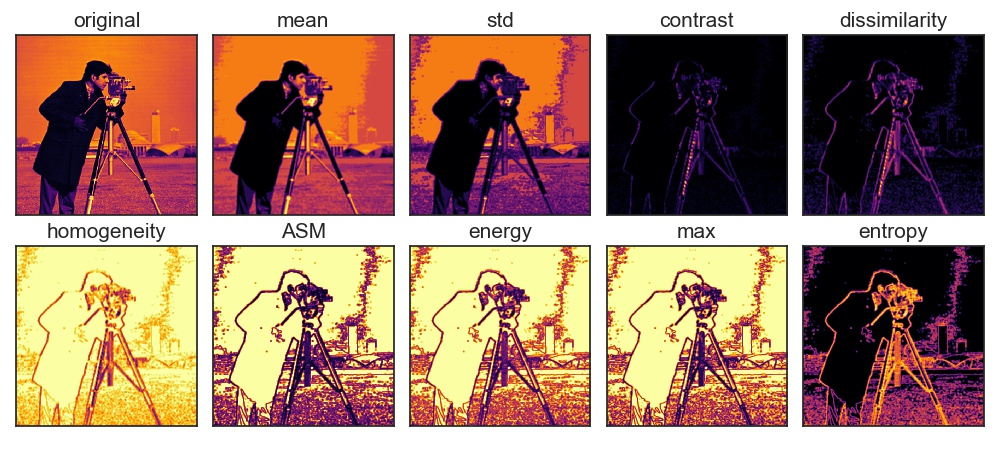

# GLCM
Fast Gray-Level Co-Occurrence Matrix (GLCM) by numpy. This script calculates GLCM without per pixel For loop, and works faster than GLCM on scikit-image.



## Usage

Clone or download fast_glcm.py. Use scripts as follows.

```python
import fast_glcm
from skimage import data

if __name__ == '__main__':
    img = data.camera()
    glcm_mean = fast_glcm.fast_glcm_mean(img)
```
